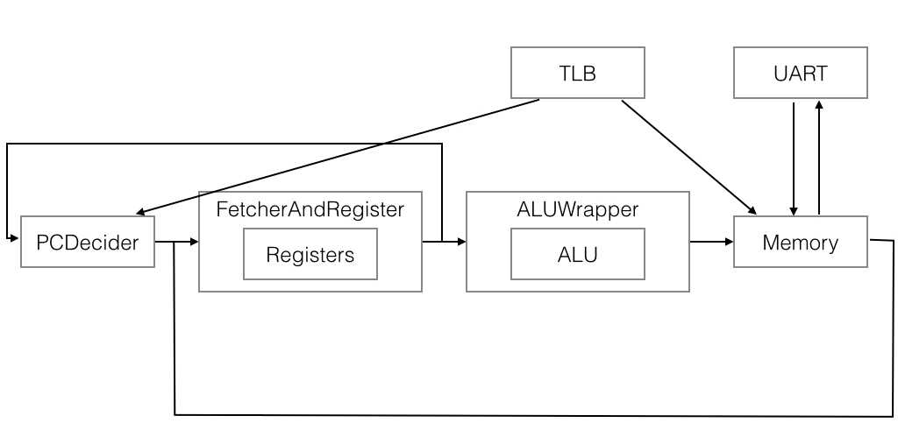

% 奋战20天，造台计算机

# 概述

我们实现了一个支持MIPS32指令集的、采用五段流水线结构的CPU，支持TLB、异常、系统调用。
另外，我们对监控程序做了些许修改，并使用Python重写了一个简易的终端使其可以在多平台上使用。

# CPU实现细节

## 流水线结构

### PCDecider

该模块FecherAndRegister相连，并与SRAM的地址总线相连，
根据输入的信号判断跳转、等待（气泡）、顺序执行等，并给RAM以地址信号，输出现在的PC值。

### FetcherAndRegister

该模块与PCDecider、ALUWrapper相连，包含一个Register子模块，并与SRAM数据总线相连，完成：

- 从RAM的数据线得到指令并译码
- 读取指令需要的寄存器的值
- 从Memory模块得到写寄存器信号并执行
- 判断跳转、等待、PC异常、TLB异常等并给出信号
- 将信号传给下一级

### ALUWrapper

该模块与前一级FetcherAndRegister以及后一级Memory相连，包含一个ALU子模块，完成：

- 根据前一级的信号完成算术逻辑运算
- 将其他信号继续传递给下一级
- 将为内存地址的计算结果通过TLB转换后得到物理内存地址，若TLB未找到则传递信号给FecherAndRegister以产生异常

### Memory

该模块与前一级ALUWrapper以及FetcherAndRegister相连，与SRAM的地址、内存总线、UART模块相连，完成：

- 根据前一级的信号完成内存读写
- 读写特定地址时改为从UART模块读写
- 将写寄存器信号传回至FetcherAndRegister

## 寄存器数据冲突的处理

当写寄存器指令执行后的三个周期内，若遇到对同一个寄存器的读操作，由于流水线结构的特性会产生数据冲突，解决方法为：

- 使寄存器模块正确处理同时读写同一个寄存器的情况，从而解决相距三个周期的冲突
- 在译码阶段记录前两条指令是否写寄存器以及写寄存器的值，当发生数据冲突时暂停流水

## 跳转冲突的处理

- 对于jump、branch指令，由于存在延迟槽，不存在冲突
- 对于syscall、中断等，由译码阶段判断后暂停流水一个周期

## 访存结构冲突的处理

虽然我们使用的硬件包含两片SRAM，在指令和数据分别存放的情况下不存在访存的结构冲突，
但是由于我们需要实现对同一个地址空间的写指令和运行指令，因此并不采用该种方法。

由于取指令和内存数据读写可能需要对同一个SRAM操作，因此将每个CPU周期分为了4个时钟周期，在前两个周期进行取指令，在后两个周期进行数据读写。

## TLB missing

当取值、访存的地址发生TLB未找到异常时，信号会传递给译码模块，其根据不同情况暂停流水并跳到中断处理地址。

# Memory Map

+-------+-----------------------+------+-----------------------+
|  name |      virtual addr     | TLB? |     physical addr     |
+=======+=======================+======+=======================+
| kuseg | 0x00000000-0x7FFFFFFF | Y    |                       |
+-------+-----------------------+------+-----------------------+
| kseg0 | 0x80000000-0x9FFFFFFF | N    | 0x00000000-0x1FFFFFFF |
+-------+-----------------------+------+-----------------------+
| kseg1 | 0xA0000000-0xBFFFFFFF | N    | 0x00000000-0x1FFFFFFF |
+-------+-----------------------+------+-----------------------+
| kseg2 | 0xC0000000-0xFFFFFFFF | Y    |                       |
+-------+-----------------------+------+-----------------------+

- SRAM物理可用地址至 0x7fffff (8M)
- Kernel在0x80000000（物理地址0x000000，也即CPU起始PC地址）
- 中断处理代码在0x80008000（物理地址0x008000）
- 用户代码一般放在物理地址0x400000以上（使用TLB）
- $sp初始化至0x807FFF00（物理地址0x7fff00）

特殊的内存地址：

- UART数据地址：0xBFD003F8（TLB转化后为0x1FD003F8）
- UART控制地址：0xBFD003FC（TLB转化后为0x1FD003FC），可写时最低位置1，可读时第二低位置1
- 数码管0、数码管1分别为：0xBFD00000, 0xBFD00004

# 监控程序

# 终端

# How to simulate

- 安装ghdl和gtkwave
- make -f Registers.makefile （仿真RegistersTestbench，或者其他几个makefile)
- open Registers.vcd （波形文件）